TARTU WALDORFGÜMNAASIUM

**INTERAKTIIVSE AUDIOVISUAALSE KOGEMUSE LOOMINE VALITUD PLATVORMILE**

Aastatöö

Tartu 2019

# Sisukord

[**Sissejuhatus** 3](#sissejuhatus)

[**1.** **Stroboskoopiline vankriratta efekt** 5](#stroboskoopiline-vankriratta-efekt)

[**2.** **Töö käik** 7](#töö-käik)

[2.1 Näide koodist koos seletustega 9](#näide-koodist-koos-seletustega)

[**Kokkuvõte** 16](#kokkuvõte)

[**Kasutatud kirjandus** 17](#kasutatud-kirjandus)

[**Lisa 1** 18](#lisa-1)

[**Lisa 2** 19](#lisa-2)

[**Lisa 3** 20](#lisa-3)

[**Lisa 4** 21](#lisa-4)

**\
**

# **Sissejuhatus**

Minu aastatöö on arvutimäng, mille tegin kasutades mängumootorit Game Maker Studio (edaspidi GMS) ja sellesse sisse ehitatud programmeerimiskeelt GML. Mängumootor (*game engine*) on tarkvararaamistik, mis on mõeldud just mängude programmeerimiseks, et arendajad ei peaks üldiselt mängude jaoks vajaminevate tööriistade loomise peale ise aega kulutama. GMS'is on peale GML'i võimalus ka kasutada *drag-and-drop* programmeerimist, kuid seda ma ei proovinud. Mängule komponeerisin ka helikujunduse, mis koosneb põhiliselt ambientstiilis eksperimentaalsest elektroonilisest heliloomingust.

Oma vormilt sarnaneb mäng traditsioonilise arvuti-rollimänguga (*RPG*) -- mängija kontrollib peategelast, liikudes ringi erinevates ruumides, tehes valikuid, sooritades ülesandeid ning pidades dialooge fiktiivsete karakteritega. Mängu niinimetatud lugu koosneb viiest lühikesest peatükist: "Kõrb", "Ärkamine", "Resonants", "Süda" ja "Tõnu kuldsed käed". Selle peategelaseks on jalg ning kogu mängu nimi on "LEG5".

Mängu stiil on absurdne ja oma visuaalses pooles viljeleb pikslipõhist kunsti. Mängu aken on 600 pikslit kõrge, ning 900 pikslit lai. Madal resolutsioon sobib pikslipõhise kunstiga ning ümarad arvud jäid hästi meelde. Terves mängus on peaaegu eksklusiivselt kasutusel vaid viis erinevat pruunikasbeeži tooni, mille valisin, et saavutada ühtse stiiliga koloriit (vt Lisa 1). Läbiva fondina on kasutusel kas *Fixedsys, System,* või *Fixedsys Excelsior*. Mängu graafika on ebatäiuslikult isomeetriline, st mäng on kahedimensiooniline, kuid imiteerib ebarealistlikult väikese nurga all vaadet.

Töö eesmärgiks oli esialgu ennekõike õppida midagi uut ja saada huvitavaid teadmisi ja võimalikult laia ülevaadet erinevatest teemadest, näiteks programmeerimisest ja arvutiteadusest üldiselt. See lai eesmärk, millest ma juhindusin, oli ka vahepeal töö edenemisele hoopis takistuseks, sest erinevate, rohkem süvenemist nõudvate teemade (näiteks masinõpe (*machine learning*) ja närvivõrgud (*neural network*), Androidi Linuxil põhinev operatsioonisüsteem, suurarvutid (*mainframe*), mikrokontrollerid, modulaarsed süntesaatorid jm) kohta pealiskaudselt uurimine segas ühele kindlale teemale keskendumist, st sellest päriselt aru saamist.

Töö on jaotatud kaheks peatükiks ja üheks alapeatükiks. Esimeses peatükis on juttu stroboskoopilisest efektist ja selle tekitatud vankriratta efektist. Teises peatükis on kirjas praktilise töö käik ning alapeatükis on üks näide minu mängu lähtekoodist koos seletustega.

# **Stroboskoopiline vankriratta efekt**

Minu mängu alguses on pruunil taustal liikuv pealkiri (*title screen*). Selle liikumine on horisontaalne ja kiireneb ning aeglustub nii, et ühel hetkel näib pealkiri liikuvat ühele poole, siis jälle teisele poole ning vahel tundub, nagu oleks ekraanil üldse mitu vilkuvat liikumatut pealkirja. Seda kutsutakse vankriratta efektiks (*wagon-wheel effect*), mis toimub antud juhul tänu stroboskoopilisele efektile.

Stroboskoopiline vankriratta efekt on optiline nähtus, mis tekib, kui piisavalt kiirel sagedusel (A) keerlevat või muul moel perioodiliselt liikuvat objekti näidata mingil sagedusel (B) stroboskoobi abil ning ülejäänud aeg peites, nii, et seda objekti on näha kaadritena, mis loob vaatajale erinevate A ja B suhete puhul illusiooni, et objekt on paigal, liigub aeglasemalt, kiiremalt ja/või vastupidises suunas. (Purves, Paydarfar, Andrews 1996: 3694) (Nishiyama 2012)

Näiteks, kui fikseeritud kiirusel keerleb propeller nelja identse tiivikuga, siis selleks, et video pealt tunduks, nagu propeller seisaks paigal, peab seda filmima kaameraga, mis teeb pilte sama ajavahemiku tagant, mis kulub propelleril veerandi ringi tegemiseks (või see aeg korrutatud mingi positiivse täisarvuga), sest siis näeb iga pilt samasugune välja. Et näima panna, nagu pöörleks propeller vastupidises suunas, peab kaamera tegema pilti natuke vähema aja tagant, kui kulub propelleril veerandi ringi tegemiseks (või see aeg korrutatud mingi positiivse täisarvuga).

Kuigi stroboskoopilise efekti mõistet võib paljudes kontekstides kohata kasutatuna vankriratta efektiga seoses või isegi samatähenduslikult, on stroboskoopiline efekt ka see, kui tegemist pole otseselt vankriratta efektiga, vaid lihtsalt liikumise illusiooni tekitamisega stroboskoobi või mingi sarnase põhimõttega seadeldise abil. Stroboskoop (kreeka keeles *strobos* 'keeris, pöörlema' ja *skoope* 'vaatan') on J. Silveti „Võõrsõnade leksikoni" (1983) järgi „optikariist kiiresti kulgevate perioodiliste protsesside uurimiseks perioodiliselt katkestatavate valguskiirtega valgustamise teel". Sellel põhimõttel töötab ka traditsiooniline filmitehnika: näidatakse valgustatud pilte vaheldumisi pimedusega mingil sagedusel ja kuna valgus jääb inimese silmale kauem pidama, jääb mulje, nagu oleks tegemist lakkamatu liikuva pildiga (Tuganov 1979).

Üks stroboskoopilise efekti kasutusi on kontrollimine, mis sagedusel mingi asi võngub või vibreerib. Tuleb vaid näidata stroboskooplambiga selle asja peale ja muuta lambi vilkumissagedust. Kui objekt näib olevat paigal, on selle võnkumissagedus sama, mis stroboskooplambil. On olemas näiteks spetsiaalsed kettad, mida nimetatakse samuti stroboskoopideks, mille abil saab kohandada vinüülplaadimängija keerlemiskiirust, et muusika mängiks õige tempoga. (Tipton 2010)

Vankriratta efekt on üldine nimetus, mis on tulnud sellest, kuidas vanades vesternides on tihti näha, kuidas vankri sõidukiiruse kasvamisel vankri ratta kodarad näivad suunda muutvat. Vankriratta efekt võib tekkida ka mittestroboskoopilises tingimuses, see tähendab ilma vaadet katkestamata/stroboskoopi kasutamata. Selle kohta, kuidas see võimalik on, ehk kuidas efekt inimese ajus toimub, on kaks teooriat, millest viimast peetakse tõenäolisemaks: *discrete frames* theory (Purves, Paydarfar, Andrews 1996) ja *temporal aliasing theory* (Kline, Holcombe, Eagleman 2004)*.* Seepärast kasutan oma töös täpsustavat mõistet stroboskoopiline vankriratta efekt.

On erinevaid viise, kuidas stroboskoopilist vankriratta efekti demonstreerida. Üks moodus on kasutada perioodiliselt vilkuvat ehk pulseerivat valgust ja pöörlevat ratast või ketast, näiteks võib efekti märgata, kui vaadata ventilaatoreid vahelduvvooluga (*AC*) elektivõrgus oleva lambi valgel (Nishiyama 2012), sest tänu vahelduvvoolule vilgub valgus väga kõrgel sagedusel. Videovormis on internetis üleval palju näiteid nii stroboskoopilisest efektist kui ka stroboskoopilisest vankriratta efektist. Näiteks võib tuua video, kus turvakaamera eest läbi lendav lind lehvitab tiibu samal sagedusel kui kaamera kaadrisagedus, mille tulemusena näib lind, tiivad liikumatus asendis, mööda hõljuvat (https://mymodernmet.com/bird-wings-camera-frame-rate-sync/).

# **Töö käik**

2019\. aasta septembris oli vaja kinnitada aastatöö teema. Kuna kirjutasin avalduse piisavalt paindliku, siis töö nii öelda algaski sellega, et täpsemalt välja mõelda, mida ma teen. Kaalul oli erinevaid mõtteid, toon välja mõned: kuskile audiovisuaalse ja interaktiivse ruumiinstallatsiooni tegemine (sisaldab programmeerimist, heliloomingut ning mehhatroonikat); mingi elektroonilise eseme muuks otstarbeks ümberehitamine, näiteks telekapuldist või mängudinosaurusest muusikainstrumendi tegemine (*circuit bending*) või vanale mängukonsoolile millegi uue sisse panemine; NFC kiipide abil mingisuguse mehaanilise mängu või konstruktsiooni meisterdamine.

Võttes arvesse enda eelnevate kogemuste vähesust ning projektide mahukust, langetasin otsuse teha tavaline arvutimäng. Lisaks oli sellel valikul teiste valikutega võrreldes üks suur eelis: füüsiliselt olemasolevate osade puudumine praktilises töös. See annab parema võimaluse dünaamiliseks loomeprotsessiks.

Otsustasin, et mäng peab tulema absurdistiilis ja mitte reaktsioonipõhine, põhirõhk atmosfääril või lool. Seda meeles hoides kirjutasin kogu järgneva protsessi ajal üles märkmeid ja ideid nii üldise kontseptsiooni kui ka helikujunduse ja visuaalse poole lahenduste ja stiili kohta. Kokku oli mitu erineva üldpildiga ideedekogu. Üks neist hakkas mulle enim meeldima ning sellest kujunes välja „LEG5". Toon välja mõned ülejäänud ideed: tekstipõhine rollimäng, kus saab siseneda teiste karakterite kirjeldustesse ja unenägudesse; nuputamismäng, mille tegevus leiab aset pimedas keldris, kus on vaja moosi otsida; mäng, kus minategelane on mesilane koos teiste mesilastega mesilastarus, mida vahepeal väljast inimesed tolmuimejaga imevad; rollimäng, kus kõik tegelased on minu sisse skanneeritud varba- ja sõrmeküüntest ning jalakarvadest tehtud; mäng, kus mängija kontrollib kahte suurt kätt kaubaautos.

Oktoobris hakkasin otsima oma mängu tegemiseks sobivat mängumootorit (*game engine*) ning erinevaid võimalusi proovima ja nendega tutvuma, sest ilma mängumootorita oleks töö maht mu võimed kaugelt ületanud. Olin natuke kuulnud GMS'ist ja valisingi ilma pikemalt mõtlemata selle, sest see tundus algajale sobiv valik. Natuke hiljem kaalusin tõsiselt uuesti alustada Godot Engine'iga, mis on täielikult avaliku lähtekoodiga (*open source*), kuid väga võimekas (nii 3D kui ka 2D toega), viimasel ajal üks kiiremini kasvavaid projekte *GitHub*'is (Godot Engine). Jäin siiski GMS'i juurde, sest olin sellega juba tööd alustanud.

Vaatamata huvile oli minu varasem praktiline kogemus programmeerimisest ja sellega seonduvast pea olematu, seega üritasin kujundada baasteadmisi, ülevaadet või üldist arusaamist erinevatest programmeerimiskeeltest (JavaScript, C\#, C++, Python). Abiks oli muuhulgas mobiiliäpp *SoloLearn.* Samuti ammutasin teadmisi, kuid peamiselt inspiratsiooni, erinevatest *YouTube'i* kanalitest. Tulemuseks olid ebamäärased ja lünklikud teadmised ning katsetused GMS'is, mis koosnesid pooleldi internetis leiduvatest õpetustest pärit koodist, millest ma täpselt aru ei saanud. Mu juhendaja soovitas mul võtta mõni konkreetne programmeerimise baaskursus ja see päriselt läbida.

Detsembris sain teada vaba juurdepääsuga programmeerimise algkursustest -- Programmeerimise alused I ja II -- mida Tartu Ülikoolis 2018/19 õppeaastal veel läbi viidi. Esimesele kursusele registreerimiseks oli juba hilja, kuid sirvisin selle materjale ja tegin ülesandeid. Tänu eelnevalt iseõpitule ei olnud see eriti keeruline. Mõned teemad olid mulle aga täiesti uued ning neid uurisin põhjalikumalt.

Jaanuaris 2019 registreerisin end kursusele Programmeerimise alused II. Alguses polnud ma väga enesekindel, sest esimene osa oli läbimata, kuid suuri raskusi siiski ei tekkinud. Üks teema, mida oli natuke keeruline hoomata, oli rekursioon. Kursuse lõpus tegin kohustusliku lõpuprojektina väikese Python'i programmi (112 rida), mis kodeerib ja dekodeerib teksti mingi teise teksti alusel. Läbisin kursuse edukalt.

Edasine töö GMS'iga läks juba ladusamalt. GML on Python'iga oma algajasõbraliku süntaksi poolest veidi sarnanegi. Õppisin GML'i põhiliselt GMS'i dokumentatsioonist. Kuna GMS on üsnagi vana mängumootor, siis algajana oli väga mugav leida foorumitest spetsiifilistele probleemidele lahendusi ja seletusi, sest peaaegu alati oli kellelgi juba sarnane probleem olnud. Mida aeg edasi, seda paremini õppisin GMS'i sisseehitatud siluri (*debugger*) ja dokumentatsiooni abil ise probleeme analüüsima ja neid lahendama.

Aprillis 2019 sain valmis esimese versiooni oma mängust, mis oli lõppversiooniga võrreldes vaid fragment. Lükkasin töö kaitsmise edasi järgmisesse kooliaastasse. Mängu tegin vahel pikemate pausidega aeglaselt, kuid järjepidevalt edasi. Suurteks takistusteks olid motivatsioonilangus ja loomekriis. Samuti osutus tihti keeruliseks enda vana koodi lugemine ja mõistmine, sest vahepeal olin palju arenenud. Kogu programmeerimine koosnes erineva raskustasemega takistuste ületamisest. Kuigi mäng ise on eesti keeles, kasutasin koodi kirjutades muutujate ja skriptide (Python'is funktsioonid) nimetamisel eesti keelt ja inglise keelt vaheldumisi vastavalt sellele, mis mulle intuitiivsem ja lühem tundus.

Tihtipeale ei kasutanud ma igasuguseid GMS'i valmis lahendusi millegi saavutamiseks, sest nii esitasin endale huvitavaid väljakutseid, mis vajavad mõtlemist. Pealegi tundsin, et GMS'i ülesehitus hakkas mind oskuste kasvades piirama ning ei kasutanud seepärast mõningaid funktsioone (näiteks ruumide süsteem), mida GMS pakub, nii, nagu neid on mõeldud kasutada. Suur piin oli see, kuidas pidi kõik järjendite (hulkasid GMS'is eraldi pole) elemendid eraldi deklareerima.

Sain praktilise osa valmis esimesel veebruaril 2020. Puhastamata lähtekoodis on 3070 rida (GMS projektide analüüsimiseks mõeldud programmi „GMLpal" järgi). Mängus on töötav *save-and-load* süsteem ja dialoogi süsteem, mille üle olen eriti uhke, sest mõtlesin selle välja täiesti ise. Mäng on Windows operatsioonisüsteemiga arvutitele ning võtab ruumi alla kahesaja megabaidi. Mäng kestab umbes pool tundi, kui arvesse võtta kõik mängusisesed tegevusvõimalused.

# 2.1 Näide koodist koos seletustega

Mu mängu sees on väike nuputamismäng iglise keelse nimetusega *star battle puzzle* (edaspidi tähemäng)*,* mis sarnaneb sudokuga. Selle programmeerimine oli üks väikestest alaprojektidest või väljakutsetest, mis ma oma mängu raames tegin. On maatriks, mis on jaotatud sektsioonideks, kuhu peab paigutama tähti nii, et igas reas, tulbas ja sektsioonis oleks üks täht, kusjuures tähed ei või olla ka diagonaalis üksteise kõrval (vt Lisa 4). On veel võimalus, et paigutatakse kahte tähte, kuid mina seda võimalust ei lisanud.

GMS'is on objektid (*objects*), millel on omakorda sündmused (*events*). Toon välja järjest objekti „obj_star_puzzle" sündmused: *Create Event -* selles sündmuses olev kood täitub ainult ühe korra siis, kui objekt „luuakse", *Step Event -* selles sündmuses olev kood kordab, kuni objekt „hävitatakse" (nagu while tsükkel Python'is mille tingimuseks on, et objekt on olemas), *Draw Event -* see sündmus on kõige graafilise jaoks, ehk siis ekraanile „joonistamiseks". (GMS dokumentatsioon)

####### **2.1.1 Create Event**

Alloleval pildil olev kood täitub ainult ühe korra, nimelt siis, kui mängija esimest korda tähemängu avab. Koodi tulemusena saame järjendi „slaud", kuhu on suvalises järjekorras pandud erinevad mängulauad (selles näites kaks) sõnedena. „Juust" on muutuja, mis näitab, mitu korda on tähemängu tehtud. Roheline kiri on kommentaarid.

{width="5.953425196850394in" height="5.4325in"}

Nüüd deklareerime muutuja mitm, mis näitab "mitu korda mitu" seekordne mängulaud on. Seejärel (alates 36. rida) loome muutuja "slaud" abil muutuja laud, mis on kahemõõtmeline järjend (maatriks) ning hoiab mängulaua ruudustiku igale ruudule vastavat tähte ("A", "B", "C" jne), mis näitab, millisesse sektsiooni see ruut kuulub. Näiteks "laud\[0,0\]" on iga laua puhul "A".

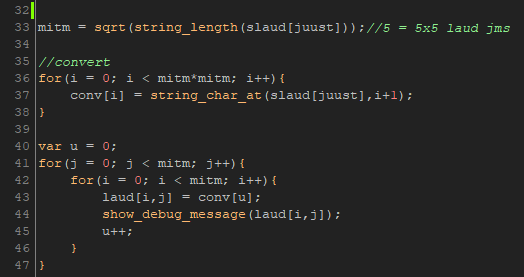{width="5.45833552055993in" height="2.8854166666666665in"}

Deklareerime muutuja "aar", mis näitab, mitu pikslit lai ja kõrge tuleb tähemängu laud (see on 400 ja see ei muutu kunagi), muutuja "uks", mis näitab, mitu pikslit lai ja kõrge on üks ruut mängulaua ruudustikus ning muutujad "selecx" ja "selecy", mis hakkavad näitama, milline ruut on ruudustikus parasjagu selekteeritud ("selecx" näitab rida ja "selecy" veergu). Siis loome kahemõõtmelise järjendi "grid", mis hakkab näitama, millised ruudud on tühjad (0), millistes ruutudes on täht (1) ning millistes punane täht (2). Punane peab täht olema siis, kui ta asetseb ruudustikus mängu reeglitele mitte vastavalt. Praegu on kõik väärtuses järjendis "grid" 0.

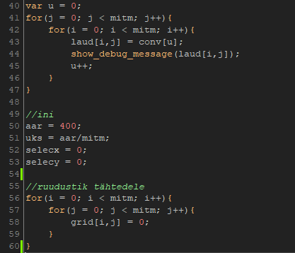{width="4.34375in" height="2.4166666666666665in"}

######## 2.1.2 *Step Event*

Kontrollime, kas on vajutatud nooleklahve, ning muudame vastavalt klahvile "selecx" ja "selecy" väärtuseid. Seejärel (alates 15. rida) kontrollime, kas "selecx" või "selecy" väärtus on väljaspool mängulaua ruudustiku, kui on, anname sellele uue väärtuse, mis on ruudustiku vastasääres (olenevalt siis kas üleval, all, paremal või vasakul). See on nagu ussimängus läbi seina teiselt poolt välja tulemine.

{width="4.40625in" height="4.916666666666667in"}

Järgnev kood täitub juhul, kui vajutatakse pikka klahvi. Rida 31-36 kontrollime, kas selekteeritud ruudus on täht, või ei ole ning vastavalt sellele paneme sinna tähe või võtame ära. Rida 38-45 kontrollime iga väärtust järjendis "grid" juhul kui see on 1 (kui ruudus on täht), skriptiga "sc_kontroll" (vt alapeatükk 2.1.3 sc_kontroll). Rida 47-51 kontrollime, kas laud on ära lahendatud (vt alapeatükk 2.1.5 sc_voit) ning kui on, suurendame muutuja "juust" väärtust ühe võrra.

{width="4.520833333333333in" height="4.135416666666667in"}

######## 2.1.3 sc_kontroll

Selles skriptis itereerime läbi "grid" väärtuste. Kuuendal real kontrollime, et ruudus oleks täht ("grid" väärtus oleks suurem, kui 0) ja et see ei oleks sama, mille vastu me teisi parajasti kontrollime. Üheksandal real kontrollime, kas need kaks tähte ("grid" väärtust) asetsevad omavahel reeglitevastaselt ning kui asetsevad, muudame nende mõlema väärtuse 2-eks. Muul juhul jätame "grid" väärtused vastavalt ühtedeks või nullideks.

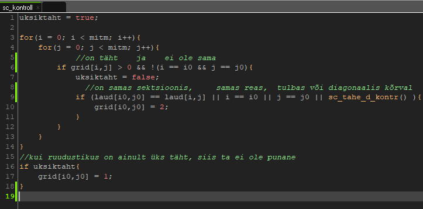{width="6.29166447944007in" height="3.1145833333333335in"}

######## 2.1.4 sc_tahe_d\_kontr

Selles skriptis kontrollime, kas kaks koordinaatidepaari asetsevad omavahel diagonaalselt kõrvuti ning kui asetsevad, väljastame "true", kui mitte, siis "false".

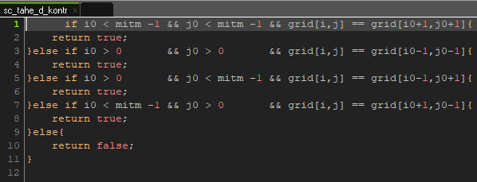{width="5.983606736657918in" height="2.2937160979877516in"}

######## 2.1.5 sc_voit

Selles skriptis itereerime läbi kõigi järjendi "grid" väärtuste. Kui ükski neist on 3 väljastame "false" (4-5. rida). Kui aga seda ei juhtu ja tähti on ruudustikus sama palju, kui ridu/veerge ruudustikus (11. rida), siis väljastame "true".

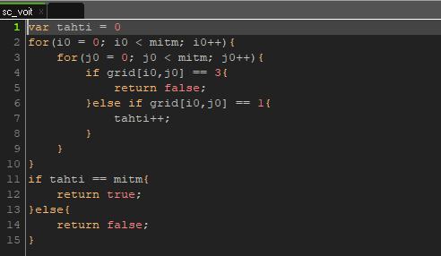{width="5.0in" height="2.90625in"}

######## 2.1.6 *Draw Event*

Kõigepealt joonistame ruudukujulise tausta, mille mõõtmed on "aar" korda "aar" ehk siis 400\*400. Siis joonistame sellele raami (5. ja 6. rida). Seejärel joonistame jooned, mis jagavad mängulaua ruudustikuks.

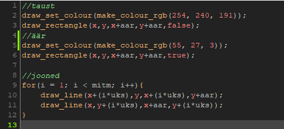{width="5.0in" height="2.2708333333333335in"}

Nüüd joonistame paksemad jooned, mis jagavad ruudustiku sektsioonideks. Selleks itereerime läbi kõigi väärtuste järjendis "laud" ning kontrollime, kas sellest paremal või all olevas ruudus on sama sektsioon, millest see ise osa on ("laud" väärtus on sama) ning kui ei ole, joonistame nende vahele paksu seina (nii mitu pikslit pikk, kui on "uks" väärtus).

{width="6.2937062554680665in" height="1.875in"}

Siis kontrollime iga järjendi "grid" väärtust ning joonistame vastavatele koordinaatidele väärtuse 1 puhul tähe ning väärtuse 2 puhul punase tähe. Viimaks joonistame "selecx" ja "selecy" väärtuste järgi vastava ruudu ümber selektsiooni märgistava kasti.

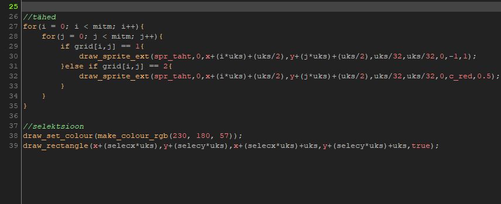{width="6.307692475940508in" height="2.575640857392826in"}

# **Kokkuvõte**

Oma töös täitsin kõik eesmärgid, mis olin endale püstitanud, peale selle, et töö kaitsta samal õppeaastal, kui seda alustasin. Õppisin töö käigus väga palju uut ja huvitavat. Saavutasin kindlasti mingisuguse arusaamise programmeerimisest ja mis peamine, sain valmis esteetilise mängu, milles on lugu, muusika ja nuputamisülesanded. Jäin töö tulemusega rahule.

Õppisin töö käigus palju paremini süsteemselt mõtlema ja organiseeritud koodi kirjutama. Töö lõpuks sain aru ajaplaneerimise oskuse tähtsusest ning sellest, kui palju aitab sellele oskusele kaasa konkreetne ja detailideni ette valmistatud plaan. Kui järgmine kord mõne suurema programmeerimist sisaldava projekti käsile võtan, tean kindlasti paremini, mida teha, kuidas töö mahtu ette hinnata ning kuidas oma aega organiseeritumalt ära kasutada.

GMS mängumootorina oli hea valik selle poolest, et on lihtsasti õpitav ja ei kohuta väga algajat mänguarendajat. Siiski ei plaani ma edaspidi seda mängumootorit enam kasutada, sest sellel on minu jaoks palju puudujääke. Tagantjärele mõeldes oleksin siiski võinud valida mängumootori, mis kasutab programmeerimiskeelena mingit sellist keelt, mis pole ainult selles mängumootoris kasutatav.

# **Kasutatud kirjandus**

1.  GMS dokumentatsioon. https://docs.yoyogames.com \[02.02.2020\]

2.  Nishiyama, Y. 2012. *Mathematics of fans*. IJPAM: Volume 78, 2012, lk 669-678. (https://ijpam.eu/contents/2012-78-5/index.html \[07.02.2020\])

3.  Purves, D; Paydarfar, J A; Andrews, T J. 1996. *The wagon wheel illusion in movies and reality*. Proceedings of the National Academy of Sciences of the United States of America Volume 93, 16. Aprill 1996, lk 3693-3697.

4.  Kline, K; Holcombe, A; Eagleman, D*.* 2004*. Illusory motion reversal is caused by rivalry, not by perceptual snapshots of the visual field.* Vision Research Volume 44, Oktoober 2004, lk 2653-2658.

5.  Silvet, J. 1983. *Võõrsõnade leksikon*. Valgus.

6.  Tuganov, E. 1979. *Liikuvad pildid.* Eesti Raamat.

7.  Tipton, R. 2010. *All About Stroboscopes*. https://audioxpress.com/article/all-about-stroboscopes \[07.02.2020\]

8.  Godot Engine. Kodulehekülg. https://godotengine.org \[07.02.2020\]

9.  

# **Lisa 1**

> Mängu värvid.
>
> http://colorpeek.com/\#rgb(55,27,3),rgb(149,89,35),rgb(230,180,57),rgb(255,232,152),rgb(254,240,91)
>
> 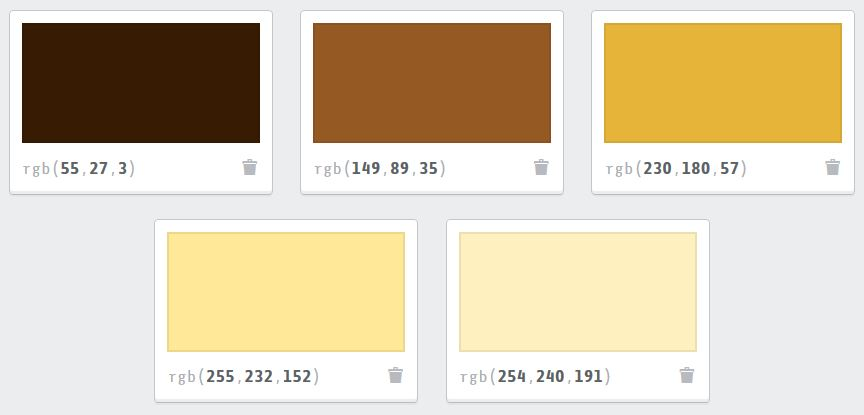{width="6.302084426946632in" height="3.01875in"}

# **Lisa 2**

> Kuvatõmmis töö käigust.
>
> 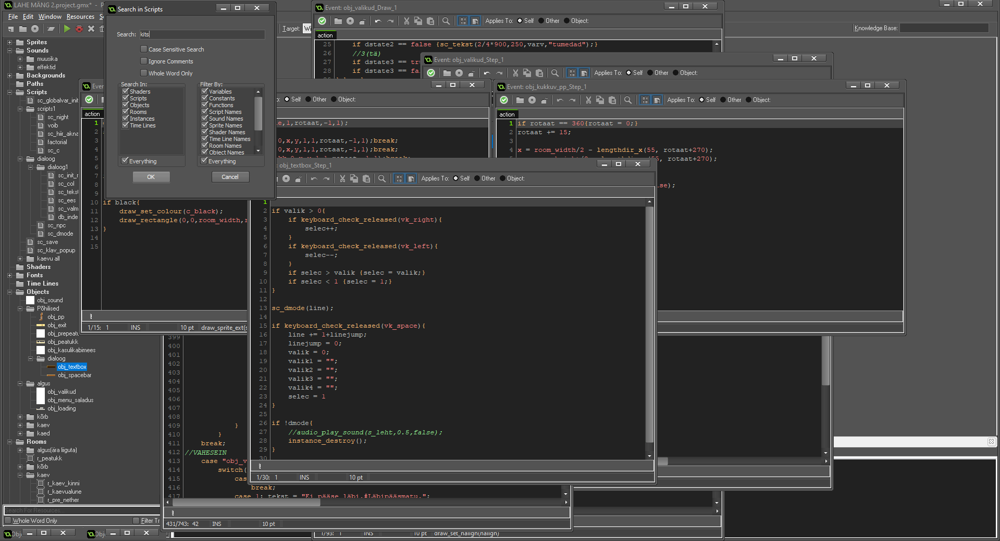{width="5.92951990376203in" height="3.2118241469816273in"}

# **Lisa 3**

> Kuvatõmmis valmis mängust.
>
> 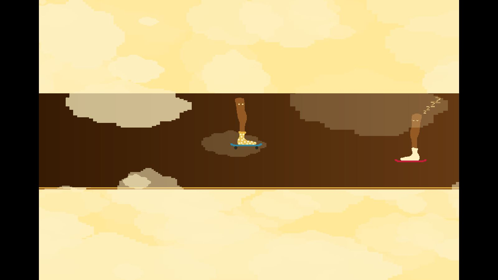{width="5.829861111111111in" height="3.8868055555555556in"}

# **Lisa 4**

> Kuvatõmmis *star battle puzzle'*ist minu mängus.
>
> 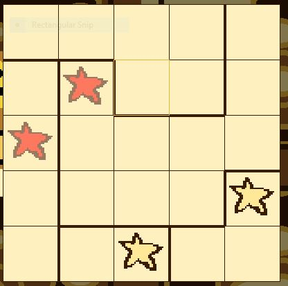{width="4.329861111111111in" height="4.302083333333333in"}
